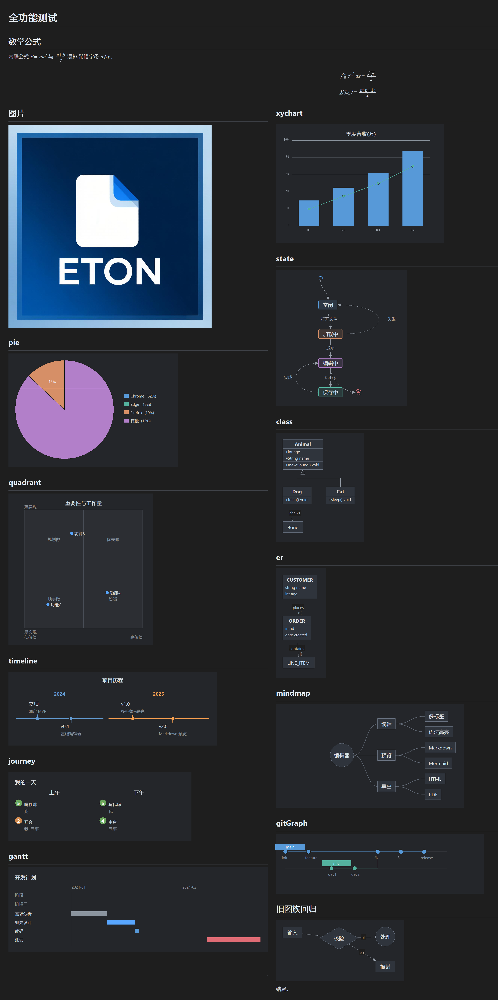

# ETON

[English](README.md) | [简体中文](README.zh-CN.md)

A Notepad++-style text editor for Windows built with the **native Win32 C API** (no MFC / Qt / .NET / Electron).

The whole program is only 2 MB.

- Builds directly with Visual Studio Build Tools (MSVC) into a single `eton.exe`
- Statically linked CRT (`/MT`) + Scintilla + Lexilla — the binary only depends on system DLLs and can be copied to any Windows machine and run
- Embeds a Common Controls v6 manifest and automatically picks up the system theme (including a dark title bar/controls)

<p>
<a href="https://get.microsoft.com/installer/download/9p1bnmg6qkf8?referrer=appbadge" target="_self" >
	
</a>
&nbsp;&nbsp;

</p>



---

## Features

| Category | Description |
| --- | --- |
| Multi-tab | Custom-drawn tab bar; edit multiple files at once |
| UI language | Simplified Chinese / English UI; follows the system UI language on first launch |
| Syntax highlighting | 10 languages: C / C++ / C# / Java / JavaScript / Python / XML(HTML) / JSON / SQL / Markdown; auto-detected by extension and switchable from the language menu; code-folding margin shown for lexer languages |
| Markdown preview | F12 toggles edit ↔ rendered view in the current tab; Shift+F12 side-by-side split (editor left, preview right, two-way synced scrolling); **13 Mermaid diagram families rendered natively** (flowchart / sequence / state / class / ER / pie / quadrant / timeline / journey / gantt / xychart / mindmap / gitGraph), unrecognized families fall back to source view with a hint; **math formulas** (`$..$` inline and `$$..$$` block, with `\(..\)`/`\[..\]` delimiters normalized automatically — a LaTeX subset: fractions, roots, sub/superscripts, Greek letters, sums/integrals, `cases`/`matrix` family/`aligned` environments with sized delimiters, typeset in Cambria Math); **footnotes** (`[^label]` refs render as link-colored [N], definitions collected into a rule + numbered list at the end, unreferenced ones omitted); **embedded images**; export to **HTML** and **PDF** (paginated via the print dialog); colors follow the light/dark theme, font size follows editor zoom |
| Multi-encoding | ANSI (system code page) / UTF-8 / UTF-8 BOM / UTF-16 LE / UTF-16 BE; BOM auto-detected on open; current encoding shown in the status bar; warns about potential mojibake when saving ANSI content that cannot be represented |
| Line endings | CRLF / LF / CR with one-click "Convert to…"; new documents and undetectable files default to Unix (LF); existing files keep their detected ending |
| JSON tools | Edit menu: JSON format / minify; applies to the selection when there is one; indentation and EOL follow document settings; on parse failure, reports line/column and jumps to the offending character |
| Developer tools | Tools menu: Base64 / URL / Unicode (`\uXXXX`) encode & decode (replaces the selection or whole document, undoable, jumps to invalid characters on decode failure); MD5 / SHA-1 / SHA-256 / SHA-512 hash dialog (all four at once, uppercase toggle, per-row copy); insert UUID v4; Unix timestamp ↔ date-time conversion |
| Find / Replace / Go to | Non-modal find dialog; case sensitivity, whole word, regular expressions, up/down, wrap-around search; all matches highlighted; Replace supports single and replace-all; Go to line |
| Bookmarks | Toggle a bookmark on the current line, jump between bookmarks, whole-line highlight |
| Recent files | Recently opened files tracked automatically; reopen with one click from the menu |
| Line-number gutter | Scintilla's built-in line-number margin, synced live while scrolling; current line highlighted |
| Zoom | Zoom in / out / reset; ratio shown in the status bar |
| Word wrap | Toggle soft wrap from the View menu |
| Status bar | Live characters / line / column / encoding / EOL / zoom |
| Themes | Light and dark color schemes; title bar, menus (dropdowns and context menus), dialogs, tab bar, editor, scrollbars and status bar all follow |
| Persistent settings | Theme / word wrap / line numbers / font size / UI language saved on exit and restored on launch |
| Command line | `eton.exe file1 file2 …` opens multiple files directly |
| Drag & drop | Drop files from Explorer onto the window, several at once; already-open files switch to their tab; directories are ignored |
| Session restore | Remembers all tabs and the active tab in original order; deleted files are skipped automatically |
| Window position | Window position/size and maximized state are remembered on exit and restored on next launch; centered on first run |
| Drafts & backups | Untitled documents are saved as drafts every 10 seconds and recoverable after a crash; unsaved changes of saved files are also backed up every 10 seconds — after an abnormal exit, reopening the file asks whether to restore; backups are cleared on tab close or save |
| External change detection | Detects whether the file was modified by another program before saving and warns about overwrite risk; detects on-disk changes when the window regains focus and asks whether to reload |
| Large files | Streamed load/save up to 1 GB with a cancellable progress dialog; files over 1 GB are rejected with a message; whole-document in-memory operations such as JSON formatting are disabled above 100 MB |

---

## Project layout

```
eton/
├── build.bat          # Build script: run directly for interactive mode; "build.bat auto" for non-interactive (automation/CI)
├── app.rc             # Compiles app.manifest into an RT_MANIFEST resource (for visual styles)
├── app.manifest       # Common-Controls v6 manifest (theming/dark) + Per-Monitor V2 DPI awareness
├── eton.exe           # Build output (single portable file)
├── eton.wxs           # MSI installer definition (WiX v7; CI builds on release tags)
├── msix/              # MSIX packaging: pack-msix.ps1 + AppxManifest.template.xml
├── deps/              # Bundled Scintilla + Lexilla + MD4C (no external directories needed)
│   ├── scintilla/     #   libscintilla.lib + headers
│   ├── lexilla/       #   liblexilla.lib + headers
│   ├── md4c/          #   MD4C 0.6.0 (Markdown parser, MIT) — md4c.c/md4c.h etc.
│   └── mermaid/       #   mermaid.min.js (embedded when exporting HTML; CDN fallback)
├── res/
│   ├── app.png        # Icon source image (1080×1080)
│   ├── app.ico        # Program icon (generated from app.png, 16–256px multi-size)
│   └── make_ico.py    # Script to generate app.ico from app.png (optional, needs Pillow)
└── src/
    ├── common.h       # Global structs, enums, cross-module declarations (includes resource.h, i18n.h)
    ├── resource.h     # All ID constants for menus/commands/controls/dialogs
    ├── i18n.h         # UI localization: string-ID enum and interface
    ├── i18n.c         # Chinese/English string tables, T() lookup, main-menu building, dialog text overrides
    ├── version.h      # Version defines (for the VERSIONINFO resource; CI generates from release tags)
    ├── eton.rc        # Accelerators, dialogs, icons, version info (menus are built in code)
    ├── main.c         # Entry point, main window proc, command dispatch, recent files, drag & drop, UI-language switching
    ├── editor.c       # Multi-tab/document management, Scintilla controls, zoom, lexers
    ├── tabbar.c       # Custom-drawn tab bar (painting and click handling)
    ├── session.c      # Session/draft persistence and restore (incl. UI-language choice)
    ├── fileio.c       # Encoding detection, read/write, EOL normalization, UTF-8 conversion
    ├── jsonfmt.c      # JSON validation + format/minify (single-pass parse, RFC 8259)
    ├── devtutil.c     # dev-tools pure algorithm layer (Base64/URL/Unicode codecs, CNG hashing, UUID)
    ├── devtools.c     # dev-tools UI (selection transforms, hash/timestamp dialogs)
    ├── statusbar.c    # Status bar (characters / line / column / encoding / EOL / zoom)
    ├── scrollbar.c    # Custom-drawn scrollbars
    ├── mdview.c       # Native Markdown preview view (MD4C parse → block tree → layout → GDI drawing; split view & scroll sync)
    ├── mdimg.c        # Remote image download & caching for the Markdown preview (WinHTTP)
    ├── mermaid.c      # Native Mermaid rendering (13 diagram families: parse + layout + GDI drawing)
    ├── mdmath.c       # Math typesetting (LaTeX subset → MathBox box tree → GDI drawing)
    ├── mdexport.c     # Export HTML (embedded mermaid.js/MathJax) / PDF (print pagination)
    └── dialogs.c      # Find / Replace / Go to / About / Open-encoding dialogs
```

> Build dependencies are bundled: `deps/scintilla/libscintilla.lib` + `deps/lexilla/liblexilla.lib` (prebuilt static libraries and headers ship with the project — no external directories needed).

---

## Building

### Prerequisites
- **Build Tools for Visual Studio** or full Visual Studio, with MSVC and the Windows SDK.
- Verified environment: Visual Studio Build Tools 2026 (v19.x, `vcvarsall.bat x64`), Windows SDK.

### Option 1: run the script (simplest)
Double-click `build.bat` (or run it from a terminal). The script:
1. Locates the MSVC environment: uses the `VCVARS` environment variable pointing to `vcvarsall.bat` first, then `vswhere` (any drive / version / edition, including Build Tools), and finally falls back to scanning common install paths;
2. Initializes the MSVC environment via `vcvarsall.bat x64`;
3. Compiles resources with `rc.exe`: `eton.rc` → `build\eton.res`;
4. Compiles all `.c` files (including `deps\md4c\md4c.c`) with `cl.exe` and links `eton.exe` (with the Scintilla + Lexilla static libraries).

For automation / CI use non-interactive mode: `build.bat auto` — no pause; prints `BUILD_OK` and exits 0 on success, prints `RCFAIL` / `CLFAIL` / `VCVARSFAIL` and exits non-zero on failure.

> In rare cases where the script cannot find MSVC, it asks you to set the `VCVARS` environment variable to your `vcvarsall.bat` and retry, e.g.:
> `set VCVARS=C:\Program Files\Microsoft Visual Studio\2022\Community\VC\Auxiliary\Build\vcvarsall.bat`

### Option 2: developer command prompt
1. Open the "Developer Command Prompt for VS" or run `vcvarsall.bat x64` manually;
2. From the project directory, run:

```bat
rc /nologo /fo build\eton.res src\eton.rc
rc /nologo /fo build\app.res app.rc
cl /nologo /W3 /utf-8 /MT /O2 /DUNICODE /D_UNICODE /D_CRT_SECURE_NO_WARNINGS ^
   /I"deps\scintilla" /I"deps\lexilla" /I"deps\md4c" ^
   /Fo"build/" /Fe:eton.exe ^
   src\main.c src\editor.c src\tabbar.c src\fileio.c src\dialogs.c src\jsonfmt.c src\session.c src\i18n.c src\statusbar.c src\scrollbar.c src\mdview.c src\mdimg.c src\mermaid.c src\mdmath.c src\mdexport.c deps\md4c\md4c.c deps\md4c\md4c-html.c deps\md4c\entity.c build\eton.res build\app.res ^
   /link /SUBSYSTEM:WINDOWS /MANIFEST:NO /LIBPATH:"deps\scintilla" /LIBPATH:"deps\lexilla" ^
   libscintilla.lib liblexilla.lib ^
   user32.lib gdi32.lib gdiplus.lib comctl32.lib kernel32.lib shell32.lib shlwapi.lib comdlg32.lib imm32.lib ole32.lib oleaut32.lib advapi32.lib winhttp.lib
```

### About build warnings
This project compiles with **zero warnings**. The manifest (including Common-Controls v6 visual styles) is compiled into the exe via `app.rc` + `app.manifest` as an `RT_MANIFEST` resource (`/MANIFEST:NO` disables the linker's own manifest generation, so **`mt.exe` is not needed**) — clean and portable.

### Key compiler options
- `/utf-8`: read sources as UTF-8, avoiding Chinese-text issues and `C4819` warnings.
- `/MT`: statically link the C runtime so the exe does not depend on `VCRUNTIME*.dll` / `MSVCP*.dll` — easy distribution.
- `/DUNICODE /D_UNICODE`: use wide-character (Unicode) APIs.
- `libscintilla.lib` + `liblexilla.lib`: Scintilla editing core + Lexilla lexers, statically linked into the exe.
- `app.rc` + `app.manifest` (`RT_MANIFEST` resource ID 1): enables system visual styles (themes) and Per-Monitor V2 DPI awareness (crisp text at high scaling, automatic re-layout when dragged across screens) without `mt.exe`.

---

## Packaging (installers)

The program itself needs no installation (single-file `eton.exe` can be copied and run directly). When you need an installer, use the following form after a successful `build.bat`.

### MSI (WiX, local / CI)

```bat
dotnet tool install --global wix
wix build -arch x64 eton.wxs -d Version=0.0.1 -acceptEula wix7 -o eton-0.0.1-x64.msi
```

- Requires the .NET SDK and the WiX v7 CLI (the `dotnet tool install` above is one-time).
- The version is **three-segment** (e.g. `0.0.1`); installs into Program Files and creates a Start Menu shortcut, per-machine scope.
- Publishing a GitHub Release (tag `v0.0.1`) triggers CI to build the exe + MSI automatically and attach them to the Release; with signing-certificate secrets configured, signtool signs automatically. For locally distributed MSIs, self-signing is recommended:
  `signtool sign /fd SHA256 /td SHA256 /tr http://timestamp.digicert.com /f cert.pfx /p password eton-0.0.1-x64.msi`

---

## Usage

After launching:
- **New / Open / Save / Close**: File menu or toolbar — `Ctrl+N / O / S / W`.
- **Switch syntax language**: choose from the language menu (auto-guessed by extension when opening `.c/.py/.json` etc.; can be changed manually).
- **Switch encoding / EOL**: Encoding and EOL menus; the status bar updates after changes. New documents default to LF (Unix) line endings; existing files are detected from content (CRLF preferred). Note: "Save as ANSI" on a file containing non-ANSI characters warns about potential mojibake.
- **Find / Replace**: `Ctrl+F` / `Ctrl+H` open the **non-modal** dialog (you can keep editing while finding; Enter = find next, Esc = close); `F3` find next, `Shift+F3` find previous; "Regular expression" supported (replacement supports group references), and all matches are highlighted.
- **Go to line**: `Ctrl+G`.
- **JSON format / minify**: Edit menu, or `Ctrl+Shift+F` / `Ctrl+Shift+M`. Processes the whole document without a selection, the selection only with one; invalid JSON reports the line/column and jumps to the offending character.
- **Developer tools**: Tools menu. Base64 encode/decode (`Ctrl+Alt+B` / `Ctrl+Alt+Shift+B`), URL encode/decode and Unicode escape/unescape are select-and-transform — the whole document without a selection, the selection only with one, undoable in one step, and invalid input on decode pops a message and selects the offending position. Calculate Hash computes MD5/SHA-1/SHA-256/SHA-512 over the selection/document's UTF-8 bytes at once, with per-row copy and an uppercase toggle; Insert UUID writes a lowercase v4 at the caret; Timestamp Convert handles timestamp (seconds/milliseconds auto-detected) ↔ `YYYY-MM-DD HH:MM:SS` in both directions (local time zone, UTC shown too).
- **Zoom**: `Ctrl+=` in, `Ctrl+-` out, `Ctrl+0` reset.
- **Word wrap**: toggle in the View menu.
- **Dark theme**: switch under "View → Theme" (title bar / tab bar / status bar / syntax colors follow).
- **Markdown preview**: open a `.md` file and press `F12` (or View → Markdown Preview) to switch to the rendered view, `Esc` to go back to editing; `Shift+F12` side-by-side split (editor left, preview right, two-way scroll sync), press again to close; scroll with the wheel/keyboard in the preview, click links to open with the system default program; supports `$..$` / `$$..$$` / `\(..\)` / `\[..\]` math (incl. `cases`/`matrix`/`aligned` environments), embedded images and 13 Mermaid diagram families; the preview refreshes automatically on save, zoom and theme follow the editor.
- **Export HTML / PDF**: File menu → Export. HTML produces a self-contained single file (embedded mermaid.min.js with MathJax CDN fallback; diagrams and formulas render interactively in the browser); PDF goes through the system print dialog for paginated rendering (choose Microsoft Print to PDF).
- **Bookmarks**: `Ctrl+F2` toggles the bookmark on the current line, `F2` / `Shift+F2` jump down/up.
- **Code folding**: for lexer-language files, a folding margin appears next to the line numbers; click +/− to fold or unfold.
- **Context menus**: editor right-click = cut/copy/paste/select all/open containing folder; tab right-click = close/close others/close all; middle-click closes a tab, double-click on empty space creates a new one.
- **Switch tabs**: `Ctrl+Tab` / `Ctrl+Shift+Tab` (or `Ctrl+PgDn` / `Ctrl+PgUp`) cycle through.
- **Auto backup**: unsaved changes of saved files are backed up every 10 seconds; after an abnormal exit, reopening the file asks whether to restore; backups are removed automatically after normal save or close.
- **Switch UI language**: Help → UI language: Simplified Chinese / English, effective immediately (no restart); remembered on next launch, first launch follows the system language.
- **Open from command line**: `eton.exe path\to\file.txt`, multiple files supported.
- **Drag & drop open**: drag files from Explorer onto the window, several at once; already-open files switch to their tab, dropped directories are ignored.
- **Session restore**: after restarting, previously edited tabs open automatically and the last active tab is restored; when launched with file arguments, only those files open. The session is stored in `%APPDATA%\eton\session.ini` and written on every tab change — safe even on abnormal exit.
- **Drafts**: content typed in "Untitled" tabs is auto-saved as drafts (`%APPDATA%\eton\drafts\`, every 10 seconds); after a crash or force exit, the next launch restores them as "Untitled N" tabs. Drafts never show an "unsaved" prompt: closing the tab discards the draft; "Save as" converts the draft into a real file; clearing the content removes the draft.

---

## Implementation notes (for contributors)

- **Editing core**: Scintilla 5.6.6 + Lexilla 5.4.9 (the same core as Notepad++), statically linked (see `deps\make-deps.cmd` to rebuild the libs). Scintilla colors text via style IDs (0–255) without touching selections, scrolling, or causing repaint storms — excellent large-file performance.
- **Tab bar**: a custom window class (`NPPTabBar`) that paints tabs + close buttons in `WM_PAINT`.
- **Line numbers**: Scintilla's built-in `SC_MARGIN_NUMBER` — no custom gutter drawing needed.
- **Syntax coloring**: `ApplyLexer` in `editor.c` creates a lexer via `CreateLexer("cpp"/"python"/...)`, sets it with `SCI_SETILEXER`, then applies theme colors per style ID.
- **Encoding & EOL**: `fileio.c` handles BOM detection, conversion between each encoding and UTF-8 (Scintilla uses UTF-8 internally), and CRLF/LF/CR normalization and conversion.
- **Large-file streamed IO**: `StreamLoadToDoc` in `fileio.c` reads in chunks safely split on line/character boundaries (never breaking UTF-8 multibyte sequences, UTF-16 surrogate pairs or DBCS double bytes), converting each chunk into Scintilla via `SCI_APPENDTEXT`; `StreamSaveFromDoc` extracts chunks via `SCI_GETTEXTRANGEFULL`, writes a temp file in the same directory and atomically replaces the original with `MoveFileEx` (cancel/failure never corrupts the original). Note: `char*` byte comparisons must cast to `unsigned char` (with signed `char`, `>= 0xC0` is always false).
- **JSON tools**: `jsonfmt.c` uses a single-pass recursive-descent parser that validates (strict RFC 8259) while emitting — formatting indents by nesting depth, minifying strips all whitespace; strings/numbers are passed through verbatim (preserving `\uXXXX` escapes). Replacement goes through Scintilla's target + `SCI_REPLACETARGET`, undoable in one step.
- **Developer tools**: algorithms and UI are layered — `devtutil.c` holds pure functions that reference no global state (hand-written Base64/URL/Unicode codecs, hashing and randomness via the system CNG `bcrypt`, with surrogate-pair handling and strict invalid-input checks), while `devtools.c` reuses the JSON tools' "selection/whole-doc + target replace + error location" skeleton. The hash dialog computes all four digests once in `WM_INITDIALOG` and the uppercase toggle just re-renders the hex.
- **Themes**: `Editor_ApplyThemeColors` in `editor.c` sets editor and highlight colors centrally, light and dark.
- **UI localization**: all user-visible strings live in the string table in `i18n.c`, looked up via `T(STR_xxx)`; the main menu is built at runtime by `I18n_BuildMainMenu` (no .rc menu resource); dialogs keep their .rc templates and have text overridden in `WM_INITDIALOG` via `I18n_ApplyDialog`; switching the language rebuilds the menu and refreshes the status bar / untitled titles, and the choice is written to `session.ini [settings] uilang`. Adding a language = one new translation column in `kStr` + one entry in the UI-language submenu of `I18n_BuildMainMenu`.
- **Markdown preview**: `mdview.c` uses MD4C (explicit GFM-equivalent flags | `MD_FLAG_LATEXMATHSPANS` | `MD_FLAG_FOOTNOTES`; the 0.6.0 `MD_DIALECT_GITHUB` also bundles admonitions, which we do not render yet) callbacks to parse the document into a block tree (paragraphs/headings/lists [incl. tasks]/code blocks/quotes/tables/rules), lays it out into drawing primitives (text lines / background rects / borders / diagrams / images / formulas) for the client width, and paints double-buffered in `WM_PAINT`; line wrapping breaks on spaces plus per-character for CJK, with baseline-aligned mixed styles; inline formulas participate in wrapping as atomic tokens. Tight lists (no blank lines between items) emit no paragraph blocks, and `AddRun` attaches paragraphs lazily. In split mode the editor takes the left half and the preview the right, with scrolling synced both ways by visible ratio (a mutex prevents sync loops). `mermaid.c` provides native parsing, layout and GDI drawing for 13 diagram families in ```mermaid``` code blocks: flowchart (longest-path layering + in-layer barycenter ordering), sequence (lifelines + vertical stacking), state/class/ER (flowchart kernel reused with three-compartment member boxes), pie/quadrant/timeline/journey/gantt/xychart/mindmap/gitGraph (`mermaid_ext*.inc` extensions); unrecognized families fall back to a code block. `mdmath.c` parses a LaTeX subset into a MathBox tree (horizontal runs/fractions/scripts/radicals/big operators, Cambria Math at three sizes + Greek/operator symbol tables) and draws it itself; `cases`/`matrix` family/`aligned` environments parse `&`-columns and `\\`-rows into grid cells measured per row, with sized delimiters (parentheses/brackets/braces/bars, Bézier-drawn) wrapping the grid, and map to OMML `m:d`/`m:m` on Word export; `\(..\)`/`\[..\]` are normalized to `$`/`$$` in place before parsing (code fences skipped, `\\[` left untouched). Images load dynamically via the GDI+ flat API (LRU cache of 16).

---

## Known limitations / possible extensions

- Markdown preview: 13 common Mermaid families are covered (flowchart/sequence/state/class/er/pie/quadrant/timeline/journey/gantt/xychart/mindmap/gitGraph); niche families (C4, sankey, requirement diagrams etc.) fall back to source for now; math is a common LaTeX subset now including the `cases`/`matrix` family and `aligned`/`align`/`gather` environments (unknown environments render their contents without special grid layout); HTML export embeds mermaid.js at 3.5 MB (generated into deps\mermaid\ after the first build); PDF export uses the print pipeline (vector text + rasterized diagrams, paginated).
- Not implemented: column/box selection, macros, plugin system, printing. Scintilla natively supports folding (already enabled) and printing (`SCI_FORMATRANGE`, can be wired up as needed).

---

## License

This project is sample code — feel free to learn from, modify and redistribute it. Scintilla and Lexilla follow their respective License.txt (HPND license); MD4C (`deps/md4c/`) is MIT licensed (see `deps/md4c/LICENSE.md`); the bundled mermaid.min.js (`deps/mermaid/`) is MIT licensed (Mermaid © 2014-2024 Knut Sveidqvist, used to render diagrams in the browser for HTML export).
